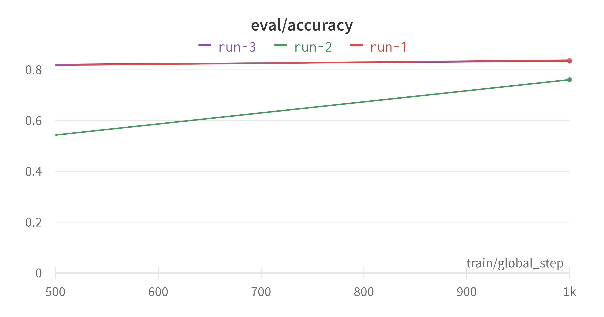
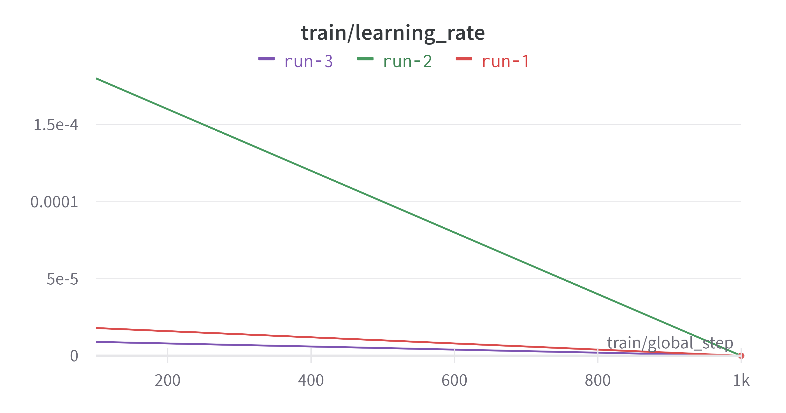
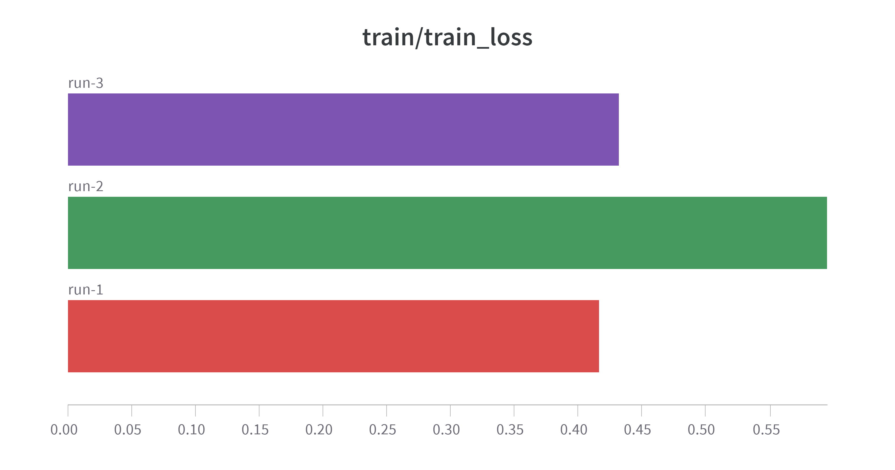
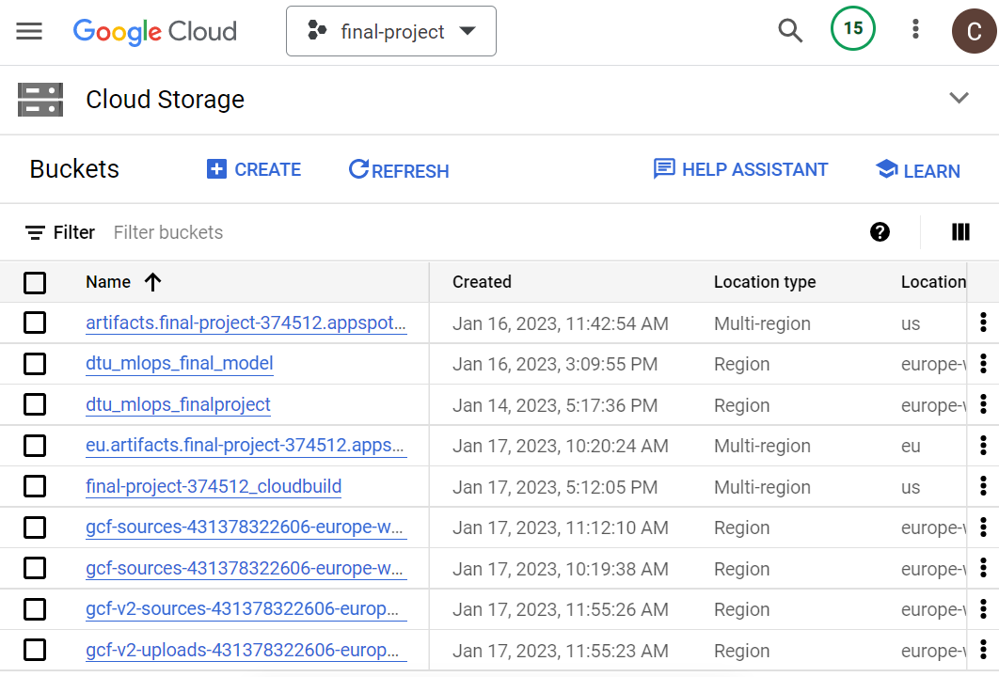
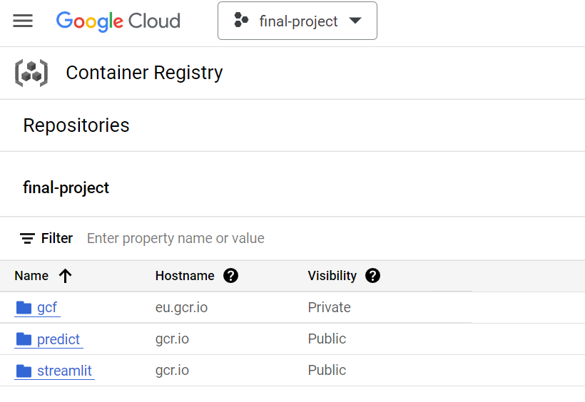
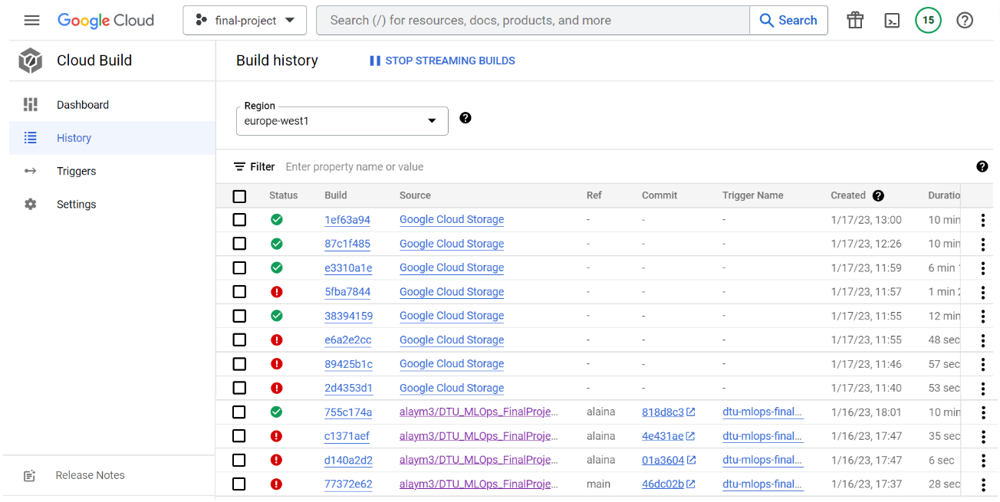
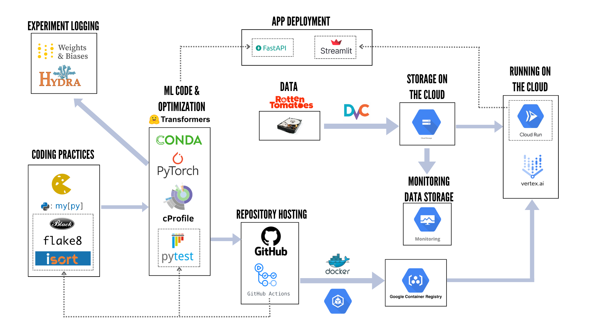

# Exam template for 02476 Machine Learning Operations

This is the report template for the exam. Please only remove the text formatted as with three dashes in front and behind
like:

```--- question 1 fill here ---```

where you instead should add your answers. Any other changes may have unwanted consequences when your report is auto
generated in the end of the course. For questions where you are asked to include images, start by adding the image to
the `figures` subfolder (please only use `.png`, `.jpg` or `.jpeg`) and then add the following code in your answer:

```markdown

```

In addition to this markdown file, we also provide the `report.py` script that provides two utility functions:

Running:

```bash
python report.py html
```

will generate an `.html` page of your report. After deadline for answering this template, we will autoscrape
everything in this `reports` folder and then use this utility to generate an `.html` page that will be your serve
as your final handin.

Running

```bash
python report.py check
```

will check your answers in this template against the constrains listed for each question e.g. is your answer too
short, too long, have you included an image when asked to.

For both functions to work it is important that you do not rename anything. The script have two dependencies that can
be installed with `pip install click markdown`.

## Group information

### Question 1
> **Enter the group number you signed up on <learn.inside.dtu.dk>**
>
> Answer:

--- 20 ---

### Question 2
> **Enter the study number for each member in the group**
>
> Example:
>
> *sXXXXXX, sXXXXXX, sXXXXXX*
>
> Answer:

--- s222712, s222701, s212937, s213252 ---

### Question 3
> **What framework did you choose to work with and did it help you complete the project?**
>
> Answer length: 100-200 words.
>
> Example:
> *We used the third-party framework ... in our project. We used functionality ... and functionality ... from the*
> *package to do ... and ... in our project*.
>
> Answer:

--- We decided to use the Transformer framework from the Huggingface group. In particular for our Natural Language Processing project, we used the pre-trained model "distilbert-base-uncased" and fine-tuned it on the task of sequence classification (where we want to classify in "positive" or "negative" the sequence of tokens). Some of the functionalities that we have used are the "tokenizer" functionality to prepare the inputs for our model, the functionality "data collator with padding" to convert our samples to PyTorch tensors and concatenate them with the correct amount of padding and the "TrainingArguments" and "Trainer" to define the training parameters. The transformer framework has helped us because, thanks to the pre-trained model, we have had the opportunity to have a very solid starting point for the development of our project. ---

## Coding environment

> In the following section we are interested in learning more about you local development environment.

### Question 4

> **Explain how you managed dependencies in your project? Explain the process a new team member would have to go**
> **through to get an exact copy of your environment.**
>
> Answer length: 100-200 words
>
> Example:
> *We used ... for managing our dependencies. The list of dependencies was auto-generated using ... . To get a*
> *complete copy of our development enviroment, one would have to run the following commands*
>
> Answer:

--- We each auto-generated a list of requirements using `pipreqs` on our computers and updated our `requirements.txt` each time we added any code. That said, we mainly used a Makefile for managing our dependencies. Thus, for a copy of our environment, a new team member would have to clone our repository in their local machine and run the commands 
 - `pip install -r requirements.txt`
 - `make data` - to download the data and put it in the right format
 - `make train` - to run the training on downloded data and save the model files locally ---

### Question 5

> **We expect that you initialized your project using the cookiecutter template. Explain the overall structure of your**
> **code. Did you fill out every folder or only a subset?**
>
> Answer length: 100-200 words
>
> Example:
> *From the cookiecutter template we have filled out the ... , ... and ... folder. We have removed the ... folder*
> *because we did not use any ... in our project. We have added an ... folder that contains ... for running our*
> *experiments.*
> Answer:

--- We created the cookiecutter template and filled in the folders and scripts as needed. These were mainly the src/models/ and src/data/ for coding the model, but we have of course also put our files in the data/ folder (although without interim or external data), our unittests in the tests/ folder and the model outputs in the models/ folder. We also have kept the makefile, the readme file, the requirements file and the setup file, as they are essential parts of a repository. On the other hand, we have removed the notebooks/ and references/ folders since we do not have other materials for exploration or explanations, and some others within the main folders, such as src/visualization/, src/features/ and the aforementioned data/interim and data/external, since we did not work with any of these aspects in our project. Besides the cookiecutter structure, we have added a folder for dvc (.dvc/), other folders for configuration files (.config/ and src/models/config/), a folder for all docker files (.docker/), a folder for the output of the performed profiling (.profiling/), a folder for our FastAPI script (.fastapi/) and a folder for our streamlit app (.streamlit/). ---

### Question 6

> **Did you implement any rules for code quality and format? Additionally, explain with your own words why these**
> **concepts matters in larger projects.**
>
> Answer length: 50-100 words.
>
> Answer:

--- We have used `flake8`, `black` and `isort` as tools for styling our code. We have used flake8 to check if our code is pep8 compliant. Then, `black` to reformat the code automatically to be pep8 compliant, which automates the formatting. Lastly, we have used the library `isort` to sort imports alphabetically and automatically separate them into sections and by type. These tools are convenient for larger projects since it is good practice that all people working together in the same project have the same format and style. ---

## Version control

> In the following section we are interested in how version control was used in your project during development to
> corporate and increase the quality of your code.

### Question 7

> **How many tests did you implement?**
>
> Answer:

--- We have implemented a total of 8 tests. We included tests to check the length of the train, test and validation datasets before preprocessing. Next we checked the shape of the tokenized datasets post-processing to ensure that our data processing scripts were running correctly. We also made tests to check if the prediction script produces the correct values. We tested the size of the output (to match the number of classes) and that the predictions were probabilities between 0 and 1. ---

### Question 8

> **What is the total code coverage (in percentage) of your code? If your code had a code coverage of 100% (or close**
> **to), would you still trust it to be error free? Explain you reasoning.**
>
> **Answer length: 100-200 words.**
>
> Example:
> *The total code coverage of code is X%, which includes all our source code. We are far from 100% coverage of our **
> *code and even if we were then...*
>
> Answer:

--- The average coverage of the code is 98%, which tests the code for making the datasets and for making predictions. The coverage of the dataset code is 100%, but that of the model is 96%. There was a skipped line in test_model.py (line 17), which belongs to the content of an if statement that is never applied, which is the reason why the percentage is not 100%.
In any case, not all the parts of the source code were checked, as there are many aspects that could be tested and more tests can always be done. As well, it is likely that the tests themselves are biased because we created them after looking at the outputs the model produces. ---

### Question 9

> **Did your workflow include using branches and pull requests? If yes, explain how. If not, explain how branches and**
> **pull request can help improve version control.**
>
> Answer length: 100-200 words.
>
> Example:
> *We made use of both branches and PRs in our project. In our group, each member had an branch that they worked on in*
> *addition to the main branch. To merge code we ...*
>
> Answer:

--- Our team has been using branches and pull requests. The main branch was protected with a few rules; i.e. at least one member needed to approve a pull request before allowing a merge. During our workflow each of the team members have been creating their own branches with their own committed changes. When a member of the group pushed to her branch new working files, the whole team was notified and a pull request was created. Each individual's branches were updated by rebasing from the main. We established the need to have somebody else accept a PR, pass all tests in all workflows and resolve all conversations, which was very useful to not merge anything accidentally.. ---

### Question 10

> **Did you use DVC for managing data in your project? If yes, then how did it improve your project to have version**
> **control of your data. If no, explain a case where it would be beneficial to have version control of your data.**
>
> Answer length: 100-200 words.
>
> Example:
> *We did make use of DVC in the following way: ... . In the end it helped us in ... for controlling ... part of our*
> *pipeline*
>
> Answer:

--- We utilized dvc in order to manage the raw and processed data for training, testing, and validation, as well as for the files that comprise our two different models. The files are located in buckets within our project on Google Cloud. Since our datasets were pre-built from huggingface and we did not add or modify it afterwards, we did not need to implement more than one version of data control for the data files. In the future we could use dvc to save different checkpoints of the model files, if we end up changing any parameters in the model after retraining. ---

### Question 11

> **Discuss your continuous integration setup. What kind of CI are you running (unittesting, linting, etc.)? Do you test**
> **multiple operating systems, python version etc. Do you make use of caching? Feel free to insert a link to one of**
> **your github actions workflow.**
>
> Answer length: 200-300 words.
>
> Example:
> *We have organized our CI into 3 separate files: one for doing ..., one for running ... testing and one for running*
> *... . In particular for our ..., we used ... .An example of a triggered workflow can be seen here: <weblink>*
>
> Answer:

--- We mainly created unit tests for our data and models in 3 separate files as explained before. We implemented GitHub actions to implement our unit tests on 3 operating systems (Ubuntu, MacOS, Windows), on the 3.8 Python version with caching. Every time there was a push or a pull from the branches 'main' and 'alaina'. This action can be seen in [tests.yml](https://github.com/alaym3/DTU_MLOps_FinalProject/actions/workflows/tests.yml)
Lastly, we introduced linting so as to maintain good practices throughout the project. We did this for isort, to keep the packages organized; for flake8, to find the points where the code wasn't compling with the coding practices of pep8 and for black, to automatically format it, fixing the issues found. We also set it up so that it run every time there was a push or a pull from the main branch. ---

## Running code and tracking experiments

> In the following section we are interested in learning more about the experimental setup for running your code and
> especially the reproducibility of your experiments.

### Question 12

> **How did you configure experiments? Did you make use of config files? Explain with coding examples of how you would**
> **run a experiment.**
>
> Answer length: 50-100 words.
>
> Example:
> *We used a simple argparser, that worked in the following way: python my_script.py --lr 1e-3 --batch_size 25*
>
> Answer:

--- We decided that an argument parser was not needed if we implemented Hydra. Therefore, we created a model_config.yaml file that allowed us to change the chosen hyperparameters of the model training. We were interested in testing different kinds of models (bert-base-uncased and distilbert-base-uncased) and different batch sizes, learning rates, weight decays and training epochs.
Inside the model script (train_model.py), we created a function in which we passed the hyperparameters in this way:

`@hydra.main(config_path="config", config_name="model_config.yaml")` <br>
`def main(cfg):` <br>
`model_name = cfg.model` <br>
`model = AutoModelForSequenceClassification.from_pretrained(model_name, num_labels=2)` <br>

To run the model with non-default hyperparameters we would run: <br>
`python train_model_hydra.py model="distilbert-base-uncased"` ---

### Question 13

> **Reproducibility of experiments are important. Related to the last question, how did you secure that no information**
> **is lost when running experiments and that your experiments are reproducible?**
>
> Answer length: 100-200 words.
>
> Example:
> *We made use of config files. Whenever an experiment is run the following happens: ... . To reproduce an experiment*
> *one would have to do ...*
>
> Answer:

--- The advantage of using Hydra is that the hyperparameters get recorded with the model output, so we do not have to record them manually ourselves. The outputs are written into an outputs folder with every training in a subfolder with subsubfolders for the models outputs and the config.yaml files, where the hyperparameters established in the command line when running the code are kept. To reproduce an experiment, one would have to look at these config.yaml files and run the model with the same hyperparameters.
As well, the entire reproducibility of our experiments is not guaranteed if we do not indicate other prerequisites such as the operating system or other software dependencies, which might be crucial to get the same results. For this, we created 4 Docker files, one for each of our main scripts: making the datasets (makedataset.dockerfile), training the model (trainer.dockerfile), making predictions using the trained model (predict.dockerfile), deploying the model on streamlit (streamlit.dockerfile). ---

### Question 14

> **Upload 1 to 3 screenshots that show the experiments that you have done in W&B (or another experiment tracking**
> **service of your choice). This may include loss graphs, logged images, hyperparameter sweeps etc. You can take**
> **inspiration from [this figure](figures/wandb.png). Explain what metrics you are tracking and why they are**
> **important.**
>
> Answer length: 200-300 words + 1 to 3 screenshots.
>
> Example:
> *As seen in the first image when have tracked ... and ... which both inform us about ... in our experiments.*
> *As seen in the second image we are also tracking ... and ...*
>
> Answer:

--- 
The first figure tracks the accuracy of the different models. As seen in the figure, run-1 and run-3 have almost the same accuracy throughout the training, while run-2 has lower accuracy.

The second figure shows the learning rate at each iteration for the different models. Run-2 has a steep decline in its learning rate compared to run-1 and run-3.

The third figure shows the training loss for all our models, with run-1 being the lowest and run-2 being the highest.

Using these metrics we were able to conclude that the model parameters used in run-1 were the most optimal for our dataset. This model was further used for prediction. ---

### Question 15

> **Docker is an important tool for creating containerized applications. Explain how you used docker in your**
> **experiments? Include how you would run your docker images and include a link to one of your docker files.**
>
> Answer length: 100-200 words.
>
> Example:
> *For our project we developed several images: one for training, inference and deployment. For example to run the*
> *training docker image: `docker run trainer:latest lr=1e-3 batch_size=64`. Link to docker file: <weblink>*
>
> Answer:

--- We built various images during our project. We built them for creating the dataset, training the model, predicting the model, and for deploying the model within a streamlit app. Our general process for building the images went as such:
1. Try building and running the image locally via the terminal
2. Run into errors, research them, and fix them
3. Once working locally, tag the image
4. Push the image to our project on GCP
5. Run a gcloud command depending on what we want to do: such as automatically creating a Cloud Run job, creating a training run on Vertex AI, or deploying the model in the model registry on Vertex AI
The dockerfile for deploying our app via streamlit on Cloud Run is contained inside [this file](https://github.com/alaym3/DTU_MLOps_FinalProject/tree/main/docker/streamlit.dockerfile.md)
Here is an overview of the dockerfile:
- use python 3.9-slim
- expose port 8080 to ensure that the streamlit web app works appropriately with Cloud Run
- copy all the necessary files from the repo
- pip install some google cloud modules that were erroring in docker build
- run a script `model_from_bucket.py` that takes in the local user’s gcloud credentials, accesses our bucket where we store our model files, and resaves them locally into a folder. This is necessary because our huggingface model requires loading all the model files from a local directory, and it is not possible to do that via a bucket.
- finally the entrypoint is to `streamlit run` our app python script on port 8080. ---

### Question 16

> **When running into bugs while trying to run your experiments, how did you perform debugging? Additionally, did you**
> **try to profile your code or do you think it is already perfect?**
>
> Answer length: 100-200 words.
>
> Example:
> *Debugging method was dependent on group member. Some just used ... and others used ... . We did a single profiling*
> *run of our main code at some point that showed ...*
>
> Answer:

---  Various debugging methods were used, depending on the problem.
1. Docker
- many many errors during docker build occurred. the first debugging step is always to just google the error and check stackoverflow for hints on what could be wrong. One team member has a Macbook with an M1 chip, which apparently is not able to successfully build and push images - so when running docker build, it has to be run on a linux platform instead.
2. Model files
- our huggingface transformers model must be loaded by loading all the appropriate files from a directory. The directory must be local. Therefore, it is impossible to use the standard `from_pretrained` command in order to load our model from our GCP bucket. We needed to write a python script that could authenticate into google and download the files from a bucket locally.
3. Authentication
- adding authentication into google inside of a docker container took a while to figure out. we of course started with google documentation but stack overflow helped us reach the right solution.
4. Uploading our model/training/other activities on GCP
- GCP has a lot of documentation and prebuilt steps for how to load models if they come in a simple file (such as .pkl) and specific frameworks. Since our model files were from PyTorch and required several files from a directory, all of the nice and prebuilt options for training models, deploying models, etc. did not work for us. We needed to research and find articles on how people have managed to implement custom jobs with these types of models. ---

## Working in the cloud

> In the following section we would like to know more about your experience when developing in the cloud.

### Question 17

> **List all the GCP services that you made use of in your project and shortly explain what each service does?**
>
> Answer length: 50-200 words.
>
> Example:
> *We used the following two services: Engine and Bucket. Engine is used for... and Bucket is used for...*
>
> Answer:

--- We used the following services: 
 - Storage - Cloud Storage is used for storage of the data and models that we are using
 - Container Registry - Container Registry has been used to store and manage Docker images
 - Run - Cloud Run has been used to run our containers and deploy our application
 - Monitoring - Cloud Monitoring was used in our project to create alerts. We created one alert that notifies us when the the storage data in the model bucket surpasses a certain limit
 - VertexAI - Used for training and deploying our model
  ---

### Question 18

> **The backbone of GCP is the Compute engine. Explained how you made use of this service and what type of VMs**
> **you used?**
>
> Answer length: 50-100 words.
>
> Example:
> *We used the compute engine to run our ... . We used instances with the following hardware: ... and we started the*
> *using a custom container: ...*
>
> Answer:

--- We could not set up a GPU VM for our project, hence we did not have much use for VMs in our project. ---

### Question 19

> **Insert 1-2 images of your GCP bucket, such that we can see what data you have stored in it.**
> **You can take inspiration from [this figure](figures/bucket.png).**
>
> Answer:

---  ---

### Question 20

> **Upload one image of your GCP container registry, such that we can see the different images that you have stored.**
> **You can take inspiration from [this figure](figures/registry.png).**
>
> Answer:

---  ---

### Question 21

> **Upload one image of your GCP cloud build history, so we can see the history of the images that have been build in**
> **your project. You can take inspiration from [this figure](figures/build.png).**
>
> Answer:

---  ---

### Question 22

> **Did you manage to deploy your model, either in locally or cloud? If not, describe why. If yes, describe how and**
> **preferably how you invoke your deployed service?**
>
> Answer length: 100-200 words.
>
> Example:
> *For deployment we wrapped our model into application using ... . We first tried locally serving the model, which*
> *worked. Afterwards we deployed it in the cloud, using ... . To invoke the service an user would call*
> *`curl -X POST -F "file=@file.json"<weburl>`*
>
> Answer:

--- We deployed our model both locally and in the cloud by different methods. Two of us deployed the model locally with the tool FastAPI by creating an API for the user to interact with our application. The other deployment of our app has been through the app framework Streamlit. We built a docker image for the app and pushed the image to our container registry. We then enabled the service in Cloud Run. You can access the service with the following url: https://streamlit-pqpw5ljsba-ew.a.run.app/ ---

### Question 23

> **Did you manage to implement monitoring of your deployed model? If yes, explain how it works. If not, explain how**
> **monitoring would help the longevity of your application.**
>
> Answer length: 100-200 words.
>
> Example:
> *We did not manage to implement monitoring. We would like to have monitoring implemented such that over time we could*
> *measure ... and ... that would inform us about this ... behaviour of our application.*
>
> Answer:

--- We implemented an alert on gcp to send us an email if the bucket in which the model was stored surpassed a certain storage limit. However, we haven't needed to monitor the model performance, since we did not do our experiments on the cloud but locally. Ideally, we could have implemented more alerts, for example to be informed when our VertexAI pipeline fails.
As well, we attempted to use OpenTelemetry to monitor the telemetry data of our FastAPI app, but even though we managed to open the Signoz visualization interface, we were unable to visualize our app on either Windows or MacOS. This would have helped monitor the quality and behavior of our app in the long term.
Lastly, we wanted to check the robustness of our model to data drifting but we did not do it because of time constraints. The reason for this is that as our data is in the form of text, we had to perform feature extraction and then use EvidentlyAI for data drifting. This could have been a good experiment to see if the model is strong against changes in the way people speak throughout time, since our data consists of movie reviews from RottenTomatoes. ---

### Question 24

> **How many credits did you end up using during the project and what service was most expensive?**
>
> Answer length: 25-100 words.
>
> Example:
> *Group member 1 used ..., Group member 2 used ..., in total ... credits was spend during development. The service*
> *costing the most was ... due to ...*
>
> Answer:

--- Group member Alaina used 785.94 kr in our google cloud project, since she was responsible for deploying the model on the cloud. The most expensive service used was Container Registry for storing our deployed docker containers. ---

## Overall discussion of project

> In the following section we would like you to think about the general structure of your project.

### Question 25

> **Include a figure that describes the overall architecture of your system and what services that you make use of.**
> **You can take inspiration from [this figure](figures/overview.png). Additionally in your own words, explain the**
> **overall steps in figure.**
>
> Answer length: 200-400 words
>
> Example:
>
> *The starting point of the diagram is our local setup, where we integrated ... and ... and ... into our code.*
> *Whenever we commit code and push to github, it auto triggers ... and ... . From there the diagram shows ...*
>
> Answer:

--- Overall architecture of our system in 

The project started by choosing our framework (Transformers) and dataset (Rotten Tomatoes review dataset). So we started locally with the ML code and optimisation. In this step we have used `Conda` to set up our project environment, PyTorch as a deep learning framework for the training and predicting of our model. At some point we also have used pythons build in profiler cProfile to see the performance of our code, and the library `Pytest` to test our code. As good coding practices for our project, we have used the cookie cutter template to get all our code organised, `mypy` as a type checker to find mistakes while typing our code, and `flake8`, `black` and `isort` for styling our code in a specific way. These last ones were implemented as GitHub actions. As a repository hosting and version controller, we used GitHub, where we stored our code files. However, for our data and model (since they are both large files), we stored them in the cloud. For the experiment logging, we have used both `Hydra`and `Weights&Biases`. The first one as a configuration tool to keep track of the hyper-parameters and the second one to record, organise and share our experiments. ---

### Question 26

> **Discuss the overall struggles of the project. Where did you spend most time and what did you do to overcome these**
> **challenges?**
>
> Answer length: 200-400 words.
>
> Example:
> *The biggest challenges in the project was using ... tool to do ... . The reason for this was ...*
>
> Answer:

--- Various struggles were encountered during the project.
1. Each team member struggled to get used to using github with others; we overcame it by battling through merging conflicts and becoming more comfortable with the tools.
2. Docker produced a lot of struggles. Some team members could barely build any images because they took so long on their computers.
3. Modifying the pre-built google cloud scripts/jobs/commands for our custom PyTorch model. We had to scour many stackoverflow discussions and articles to figure out how to deploy our model in custom training jobs, model deployment, and on cloud run. 
4. Building yaml files to automatically run various docker commands was extremely difficult, when we needed to add credentials and security and run other python scripts  and dvc pull commands at various points. It was difficult to find the exact answers in google cloud documentation and in stackoverflow. ---

### Question 27

> **State the individual contributions of each team member. This is required information from DTU, because we need to**
> **make sure all members contributed actively to the project**
>
> Answer length: 50-200 words.
>
> Example:
> *Student sXXXXXX was in charge of developing of setting up the initial cookie cutter project and developing of the*
> *docker containers for training our applications.*
> *Student sXXXXXX was in charge of training our models in the cloud and deploying them afterwards.*
> *All members contributed to code by...*
>
> Answer:

--- We all contributed actively in the project and divided the tasks. Alaina was in charge of creating the repository, creating the cookiecutter structure and setting the coding practices. She also did some unittests for the data, created and built the docker images and deployed the app on Streamlit. As well, together with Siddhi, she worked on deploying our model in the cloud. Siddhi was responsible for loading the data and doing all the data processing, executing the training experiments and logging them in W&B and dealt with the version control and storage of our data in gcp buckets. Alejandra and Carolina wrote the training script, deployed the app locally with FastAPI and evaluated the feasibility of minimizing boilerplate, checking data drifting, doing quantization and monitoring the FastAPI app with OpenTelemetry. Alejandra was also in charge of doing the predict_model script, code typing and commenting and profiling. Lastly, Carolina worked on incorporating Hydra, created unit tests for the model output and checked the coverage of the tests, included distributed data loading and added alerts on gcp. She also implemented GitHub actions with Alaina. ---
